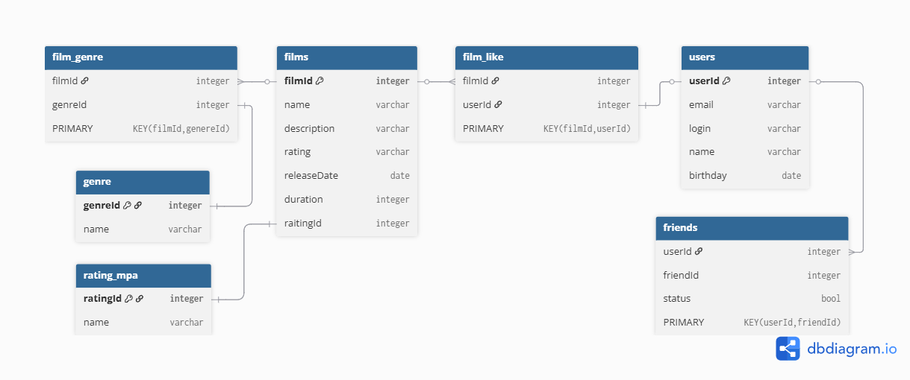

# Java-filmorate
### Приложение для оценки просмотренных фильмов, с возможностью регистрации новых пользователей, добавления в друзья и ставить лайки понравившимся фильмам.

---
## База данных проекта

Примеры запросов:
1. Получение пользователя с ID = 1:  
   SELECT*  
   FROM users  
   WHERE user_id = 1;
2. Получение фильма с ID = 10:  
   SELECT*  
   FROM films  
   WHERE film_id = 10.

___